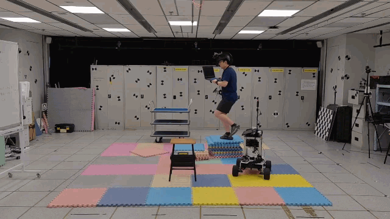
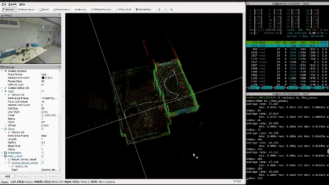
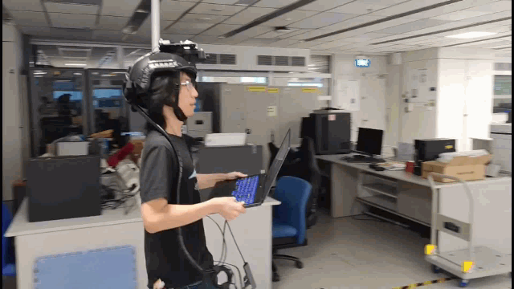
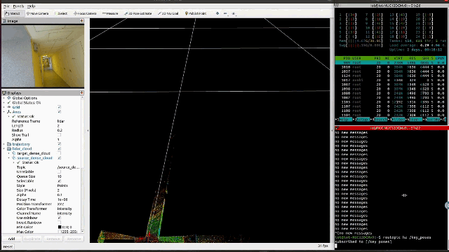

# HCTO is designed for prior map constraction for robot "last-mile" delivery using wearable device

[]()

```
@article{li2024hcto,
  title={HCTO: Optimality-aware LiDAR inertial odometry with hybrid continuous time optimization for compact wearable mapping system},
  author={Li, Jianping and Yuan, Shenghai and Cao, Muqing and Nguyen, Thien-Minh and Cao, Kun and Xie, Lihua},
  journal={ISPRS Journal of Photogrammetry and Remote Sensing},
  volume={211},
  pages={228--243},
  year={2024},
  publisher={Elsevier}
}
```


# Experimental resuls of HCTO-LIO (Click the gif for a non-speeding-up video)

## 1. Evaluation in Vicon Room
## 1.1 Seq 1 (Walking :walking:) 
[](https://youtu.be/bteNkqTTbmc)

More experiments are listed on Youtube.
## 2. Evaluation in Indoor Environment
### 2.1 Seq 1 (Running :running:)
[](https://youtu.be/bteNkqTTbmc)
### 2.2 Seq 2 (Running :running:)
[](https://youtu.be/vxcTwIaPzkQ)

### 2.3 Seq 3 (Running :running:)
[](https://youtu.be/Wr0OaHNUDx8)


## 3. Evaluation in NTU Campus
### 3.1 Site1 - Seq 1 (Walking :walking:)
[](https://youtu.be/N13U347tsfI)

### 3.2 Site1 - Seq 2 (Running :running:)
[](https://youtu.be/Za6-L4I1gdk)

### 3.3 Site1 - Seq 3 (Walking :walking: & Running :running:)
[](https://youtu.be/oG9joxEaSsA)

### 3.4 Site2 (Multi-level Auditorim) (Walking :walking: & Running :running:)
[](https://youtu.be/s_sqgfjmTZk)

## 4. Evaluation in WHU-Helmet dataset (https://github.com/kafeiyin00/WHU-HelmetDataset)
### 4.1 Subway station (Walking :walking:)
[](https://youtu.be/5B58Pxudx2I)
### 4.2 Carpark (Walking :walking:)
[](https://youtu.be/oCSmyP0jsBY)


## 5. Degenerated scenes in apartment

### 5.1 Multi-level apartment (Running :running:)
[](https://youtu.be/Hdid1JpgsgE)

### 5.2 Long corridor inside apartment (Walking :walking:)
[](https://youtu.be/e0A4Eri_8Ho)

